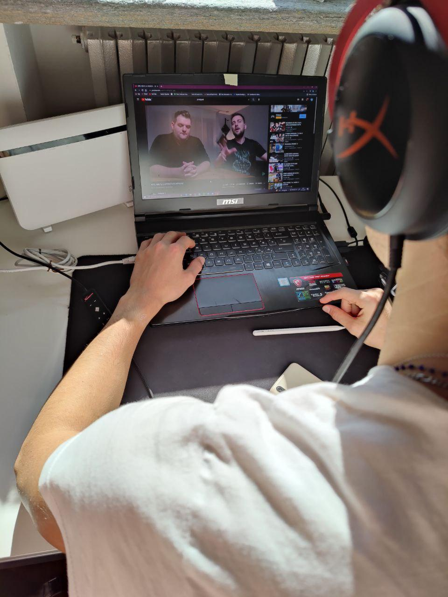
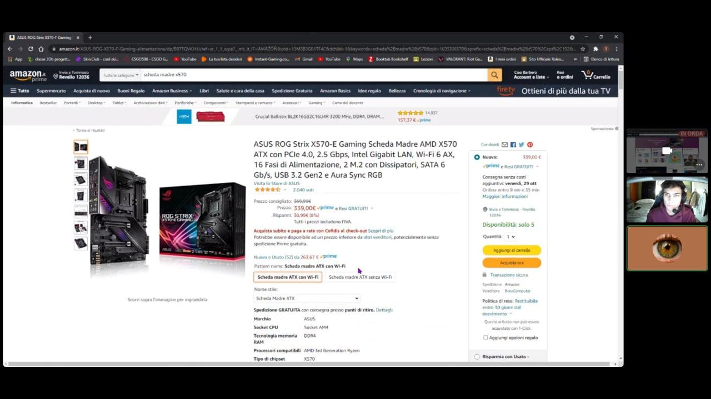
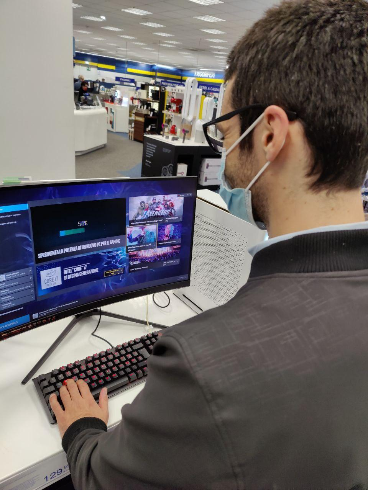

# Milestone 1: Project description and Needfinding: AceGamerApp

## Overview and planning

For our observations, as our target population, we have selected:
* Different kinds of PC users who want to upgrade their PC to play a game their current build is not able to run.

As our main activity to observe, we have chosen:
* The **research and decision making processes** the said population undergo before they upgrade their PC. 

With our interview questions and observations, we mainly intended to examine: 
* How they do the research for the requirements of games, 
* How they search for the products in the market that would comply with such requirements,
* Then after their research, how they decide on what to buy. 

To make our observations as comprehensive as possible, selecting profiles of somewhat different cases was crucial. There are people that follow the latest technologies in the market and there are people who have no idea where to start the research and shopping, and then there are also people who don't even know the difference between a normal PC and a gaming PC. We have not only targetted those who are not very knowledeable about hardware but also those who are knowledgeable but too lazy to do the research for the latest hardware products that would be the best for such games. 

With our interview questions and different observation cases, we aimed to be influenced by the user needs to develop the best algorithm to find the best product for every individual. To acquire the best feedback, we have selected our questions to specifically determine what they tend to **prioritize** if they're to shop for a new product.

## Observation
We have made three observations that cover the most likely scenarios that would take place during a research for hardware products. One being a YouTube search, one being a conversation with an expert friend, and the other being a conversation at a tech store. 
We focused on examining the processes they have taken during their research, whom they decided to rely on, what kind of questions they asked to their trusted sources, and what kind of answers they received. 
### Observation 1
The first observation was the one made with Giovanni. Giovanni is a young PC gamer that started playing with his laptop a few months ago. When he bought the PC, he wasn't informed much about hardware and after trying to play a couple of new games, he realised that his PC needs an upgrade. 

For collecting information about which hardware piece can be upgraded, Giovanni uses Youtube where he is following some YouTubers that can explain in a simple way what the specifications to look at are. He clicked on a video which influenced him to upgrade the RAM. He doesn't know much about RAM models so he started to look at some more videos about RAMs in particular. From the two videos we watched with him, we have seen that the YouTuber showed his subscribers a few RAM models and after that he listed the most important specifications for each model. The YouTuber also tried to explain the meaning of the various specifications in a simple way. 

The main issues that we've found in this observation were the difficulty to find new videos about recent products, having to scavenge through the wide range of diverse subjective opinions and having to merge different opinions on different cases to fit his case as accurately as possible.

### Observation 2
The second observation was with Tiziano, a law student who likes to play with his gaming desktop PC in his free time. During the observation, we attended a videocall between Tiziano and his friend Carlo (an expert in Computer Science) about which hardware part he should upgrade in order to have the best performances for the games coming in the next years. 

First of all, Carlo asked Tiziano to show him his current configuration; Tiziano didn't know where to find this data so he needed to be helped in the search of the section of his operation system where all the data was listed. After a small online search, Carlo understood that the "bottleneck" of the current configuration was the CPU, so he suggested his friend to change it. Unfortunately, the CPU of Tiziano was from an older generation and his motherboard didn't support the new chips, so if he wanted to upgrade the CPU, he also had to upgrade the motherboard. Tiziano said that he didn't know how to understand if a motherboard is compatible or not, so Carlo told him the keywords to use for a research and showed him some models on an online shop. 

Judging by this observation, we decided that the research for hardware is bound to be elongated by the issues arising from component compatibility, and decision making based on prices and performance, especially for the users who are not really knowledgeable in the field.

### Observation 3
The third observation was with Davide, a management engineer, who went to the tech store to test the new gaming computers on the market. Davide at the moment doesn't own a gaming PC but he is playing on consoles. Thus, he doesn't know which would be the right PC for his needs because he doesn't know the requirements of his favourite games. For gathering this kind of information, Davide relies on the suggestions of the clerks. 

At the tech store, the clerk asks what kind of games Davide likes to play and Davide makes a list of his favourite games and then the clerk suggests him different desktops. Since the clerk was not sure about the requirements of all the games, he had to suggest him diverse alternatives. The first option was a mid-range desktop with a good gaming GPU, the second one was expensive but also was way more powerful, and the clerk told Davide that it will not have problems to run all the games in the next years. In the store, there were some desktops with similar prices but the clerk didn't suggest them because their build was not very well balanced. He told Davide that a high-end GPU is wasted if the rest of the build is not powerful enough. 

From what we have seen in this observation, we noticed that Davide was not very much interested in understanding why a certain build is better than another, he just needed to know if it can run his favourite games smoothly and he wanted to gather this information as quick as possible.

### Interviews
#### The List of our Questions:
1. How long have you been playing videogames? Have you already had a gaming experience with the PC platform?
2. What is your idea about PC gaming? Why is it different from using other devices (consoles or mobile platforms)?
3. From 1 to 10 what is your level of experience with gaming hardware? What do you mean by your score?
4. How do you organize the process of the search for a new hardware component?
5. What is the most difficult thing about the process of retrieving information about hardware?
6. What do you do to determine your needs?
7. Have you ever assembled/updated a gaming PC or have you ever seen anyone doing so? If yes, which part of the whole process do you think is the most difficult?
8. How much do you care about the price? About durability? And about the brand?
9. Can you tell us 3 pros and 3 cons about self-building a PC? 
10. In your opinion is there anything else that you'd want to tell us about your research?
11. How do you feel about this interview?

#### The summary of their answers:
1. Most of the responders said that their gaming experience is very long, in some cases even 20 years.
2. The users answered this question by saying that they found the PC gaming more versatile (free online, game mods) and they like it that they can upgrade their platform.
3. Most of the interviewed users have a good experience about PC hardware.
4. The majority of the research processes of the users is made online in a different way; some get information on social media, others follow some hardware websites that review the new components. For the majority, the budget is very important and they start making decisions from this constraint. Once they decided on 2 or more alternatives, they start to look at comparisons on Youtube or a comparison site.
5. The main issue is the lack of transparent information online. They said that it's difficult to find clear information online, usually the information are non-specific and outdated.
6. They mostly base their needs relying on the games they want to play and also on the budget available.
7. The majority of the responders assembled a PC, while others did not.
8. The majority of the players did not care about the brand. The main element for the decision is the price, followed by durability and then the brand.
9. The main pro is the satisfaction to get a tailored working machine. The main cons are that a good knowledge about hardware is required and that there is no warranty on your damages.
10. The responders did not propose any extra questions.
11. The responders were happy to take part in the interviews, most of them have stated that the research was very interesting.

## User Needs
1. They need to specify the requirements of the games they want to play.
2. The user would like to have a rather narrow, less confusing set of alternatives so that the selection process would be easier and faster.
3. They need to regulate their budget to be able to purchase every single component they will need.
4. The ones that are upgrading need to have a simple recap of the hardware they already own to spot the weak points of their existing setup to see if it can handle the said games and to change only the ones that need to be changed, instead of changing the whole setup.
5. The user would like to be informed by a comparison that is based on the price-performance ratios of different products.
6. Most of the respondents prefer to get information from websites, but a large number of people also said that they get information on social media.
7. They mostly base their needs relying on the games they want to play and also on the budget available. 

## Project Description
Our project will be a web application which can be accessed by a PC. The scope of the project is to make the searching procedure easier for our target population by providing them a platform where they will be able to spend a small amount of time to find the best products for their needs. As mentioned in the *Overview and Planning* section, we kept our target population to be diverse: from experts to users that doesn't know much about hardware. Therefore, a simple interface and a short research time is vital. We aim to achieve this by asking the users as few questions as possible, and in the end, bringing them as little amount of options as possible to ensure the decision process does not take a lot of time and cause confusion. 

We plan on keeping the main activity as simple as possible where the main action the users will have to take will be to inform the website the game they want to play, and so it could help them decide which products would be most suitable for their needs. In the meantime as mentioned above, possibly with filters, to keep our low-confusion strategy, the alternatives shown will be narrowed down as much and as effectively as possible. 

