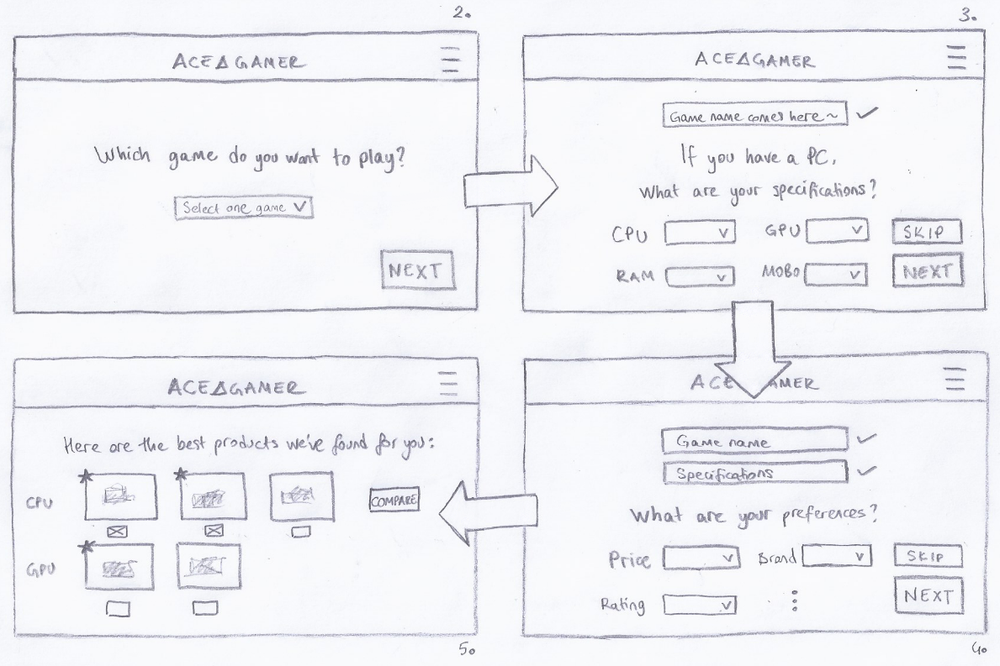
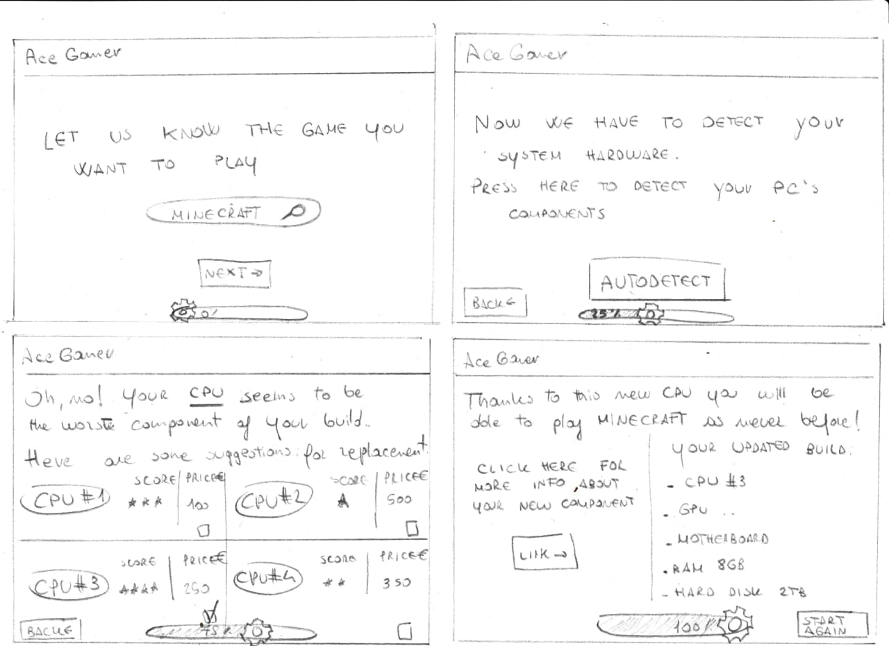
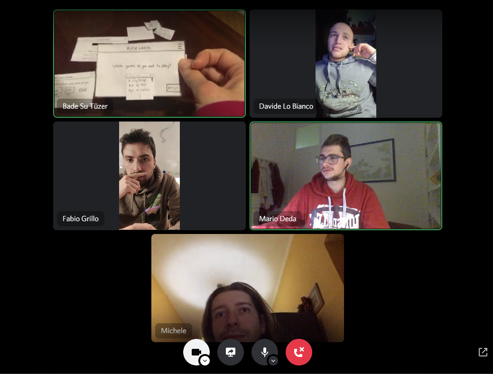
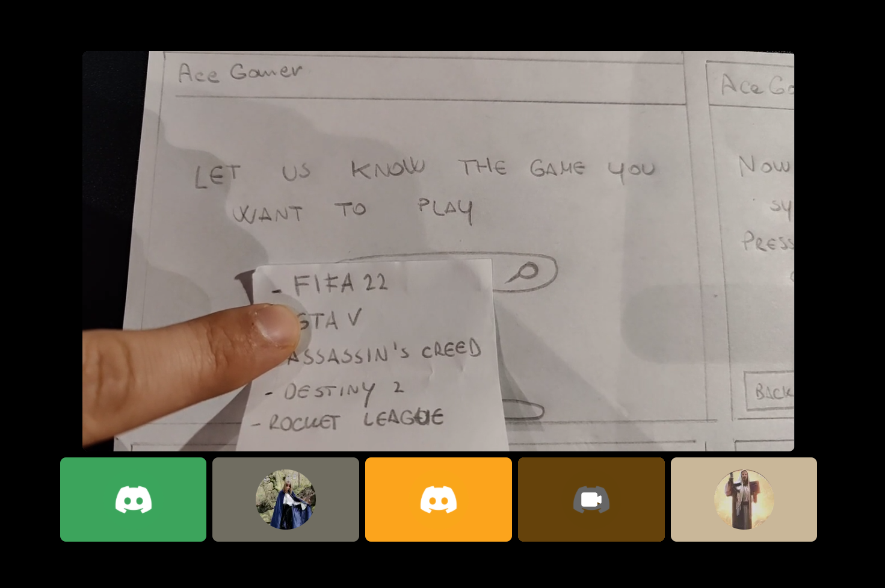

# Milestone 2: Prototyping and Heuristics - AceGamerApp

## The Storyboard

  

### Description

* Here in our storyboard we illustrated a PC user that watches the trailer of a game that's just released. By checking the "minimum requirements" he guesses that his current setup won't be able to run it. However our character is also not very knowledgeable in the field, so when he's to check the products in the market, he gets confused by too many options. He then finds our website which claims to provide a totally simple service. Then through basic steps, he finds the best options for himself. In the last frame, it is shown that he is able to play the new game on his upgraded PC.  
* We have chosen this storyboard because it can summarize how our application will be able to solve the most important user need of our target population in a very straightforward way. 
* As its most significant strength, this storyboard can illustrate the most likely scenario that shows why our target population could be led to our application and then which main steps they would be taking in the simplest way. However, as a weakness, it does not show every single user action we aim to provide to help them reach their goal *(the last frame)*. 
* We believe our storyboard directly highlights the main user need we have determined, which is finding an easy and less time-consuming way to find the best products in the market specifically for their own needs. 

## Paper Prototypes
## Prototype 1
### 1. Navigation Between Screens and the Summary
Here in the navigation illustration of our first prototype we've shown the overview of the screens, how they interact with each other and what the user needs to do to progress through the flow. Each step will be explained in more detail in their dedicated sections below. 

Both in our storyboard and in our prototype we've mainly adressed the following user needs we've determined in M1:
* To have as little amount of options as possible to have less time to make a decision, and to minimize confusion. 
* To be able to merge the game requirements with the user's specific preferences to make the final call for the options shown on a website. 

We have wrapped these needs altogether in a simple and fast design for our target population to reach their goal in our prototype. We aimed to do so by having the user make selections to help reduce the alternative paths the user can take to a minimal level. 

### 2. Main Page / Game Selection

  

Here in the main page, we've illustrated a simple design where the user is solely expected to select the game s/he is willing to play. The user can only make one selection, and then s/he can submit it without having to login or do anything extra for the calculation process to progress through this step by clicking *"NEXT"*.  
### 2.1 Menu

  

However, the user can also decide to create an account where his/her selection will be saved, or log in if s/he already has an account. If s/he wants to skip through the steps s/he's about to take, s/he can also search though the list of products and games that would have been shown in the website.
### 3. Specification Selection Page

  

After the user selects the game, s/he is taken to the second page where s/he is now expected to specify the specifications of his/her PC if s/he has one. S/he is expected to select as many as possible, but if s/he needs to leave a selection empty (because s/he does not own one, or s/he certainly wants to replace it), s/he can still submit with the rest of the selections that s/he's made. If s/he does not have a PC or has no idea about the hardware parts that s/he owns, s/he can select *"SKIP"* to skip this step altogether. Once this step is skipped s/he is redirected to *Preference Selection Page*.
### 4. Preference Selection Page

  

After the user goes through the *Specification Selection Page*, s/he is redirected to this page where s/he needs to this time specify his preferences for the hardware products from a price range to a brand. This section can also be skipped. 
### 5. Results Page

  

After the user completes every step either by skipping or making selections, s/he is finally on the results page where s/he will be shown several products for him/her to choose from. The products will be sorted from the best choice to less suitable ones, listed separately for each category. However, the number of options will still be kept minimal, so there will be mostly 3 or 4 options for each category. 

If the product is selected to be the best choice with respect to the selections the user has made, a star will be shown on top left side of it. The user can click on *"COMPARE"* to compare the products in the row to make a better final decision.

### 5.1 Comparison Pop-up

  

Here in the pop-up, two products can be compared and the one with the most suitable features will be highlighted. 

## Prototype 2 (edited)
### 1. Navigation Between Screens and the Summary
As we've shown in the first prototype, here we show at first glance the illustration of the overview of the screens including the flow between each window and the next one in order to better demonstrate the progression.

We aimed at minimizing confusion caused by a complex interface which could be derived from users' inexperience trying to help them reaching their need in the simplest way possible for our purpose. Furthermore another relevant point is the step by step approach using a progression bar which focuses on keeping the user always aware on what s/he is doing. 

Such as in the previous prototype the goal is to help reduce the alternative paths the user can take using simple selections.

### 2. Main Page 

  

Following up the step by step approach, from the beginning, the user simply has to write the game he/she wants to play on the form and then click on the *"Next"* button to get  AceGamerApp to start. Each step is accompanied by a text which would explain an inexperienced user what to do.

### 2.2 Detection page

  

The second simple step into gaming PC building, as it can also be seen from the interviews, is to undestand which part of the whole PC has to be changed depending on the selected game. So, this page is meant to let every user be able to detect the hardware of their PC by a simple click on *"Autodetect"* button. This action will simply allow to list each component of the user PC and then to understand which one is the worst. As said before, the entire process is bound to a text that explains to users what is going to happen in the simplest way possible: that's is the reason why, even if on this page there is only one button to click, we decided to insert a text explaining the function of that single button.

Back button allows the user to be redirected back to the main page and select another game.

### 2.3 Component selection page

  

As specified before, we aim to let the user be comfortable in each step of the entire process. To do so we added a progression bar below that should keep track of what stage the user is in with a written percentage on it. 
After detecting hardware components, the user will be redirected to the selection page. The weakest part of the PC would be found and the application automatically will let users know what it is (e.g. CPU, GPU, ...). On this page,  a text with the name of the less performing component and a list of possible replacement parts with a score and a price (if available online!). This allow users to selected which item they prefer and then, clicking on it, they will be redirected to the result page.

The *Back* button lets the user to return on the main page.

### 2.4 Result Page

  

Once the progression bar fills in, a minimal text shows up telling the user that the process has been completed. Right below the page is split into two different parts. The one on the left contains a link button that redirects to an online shop with all the statistics of the selected component, while the one on the right shows the list of the detected components with the new selected item in order to let the user have a general view on the new PC build.

We inserted a *"Start again"* button that allows the user to return to the main page and select a new game.

## Heuristic Evaluation

In order to do the heuristic evaluation, we created two paper prototypes with two different implementations of our project. To keep track of the ratings we created a shared [Google sheet](https://docs.google.com/spreadsheets/d/1JNDuY8p5LJlGJAnml7IVrrsYTAoL3UN0rPCFdp6pKkk/edit?usp=sharing) document and there we saved all the different issues pointed out by the evaluators. All the ratings were based on Nielsen's [10 Usability Heuristics for User Interface Design](https://www.nngroup.com/articles/ten-usability-heuristics/).

We did the heuristic evaluation with the help of the *GuideMe* team. For both prototypes we did a small presentation of the user needs we wanted to satisfy with them and then we asked them to interact with the prototype. The evaluators sometimes asked us what would have happened with the pressure of a button and we answered them. We have redone our evaluations again remotely but this time by using cameras for the users to interact with the paper prototypes in a more realistic way. 

#### The Remote Evaluation of P1 via Discord

#### The Evaluation of P2 

After the presentation of each single prototype we asked our evaluators for their feedback and we asked them to compile the evaluation grid. Their feedback has been very useful because they noticed some issues that we didn’t account for. Where they could be summarized as:

### For P1
- Add a back button for each page. 
- An information pop-up to inform the non practical users what the main components of a PC are 
- A different approach to reach users who do not know how to check for the specs - one of the evaluators recommended us to ask the user what kind of games his current PC can play to have an idea of its minimum capacity
- Add a progress bar
- Use a search function instead of having a dropdown menu for game selection

### For P2
- Make progress bar stages clickable
- Show sidebar with the proposed components
- Highlight the cart sidebar when the build is completed so the user can understand that s/he has covered all the things he needs
- If more than 1 component needs upgrade, show both of them
- For expert users, provide a manual component selection
- Add fallback in case the "Autodetect" doesn't work
- Add an overlay to show upgraded component benefits and advantages

## Final Decision
After we’ve met the evaluators to get their feedback, we’ve decided to combine two prototypes together in order to get the strong points of both prototypes. The changes we are planning to implement or not to implement can be listed as:
 
### Implement
- A progress bar
- The auto-detect option which leads the user as a fallback to the manual selection option in case auto detection fails. This option is the one we are prioritising and encouraging our users to use, because it covers our whole target population.
- The manual selection option as an option for users who have been led to this option because auto detection failed, or the users who want to use the application for another PC they want to upgrade. For this option, the user must be aware of the components they own.  
- An information page with the basic information to inform clueless users what the function of a specific component is.
- A summary page that has the list of the whole build at the end of the configuration so the user can have an overview of the current situation. Both of the evaluators have liked the summary page of P2, so we decided to implement it as well. 

### Not implement
- The option for users to select a game that their current build can already run, because we thought it might not always provide an accurate solution. 
- The login option. We didn't deem it necessary for our application, because the users can easily try for new games, use autodetect on their current PC, or use manual selection for another device within a couple of minutes without having to load a saved setup. 
- Filters. With respect to our observations with the responders as seen on *[Milestone 1](https://github.com/polito-hci-2021/AceGamerApp/blob/main/M1/Milestone1.md)*, we noticed that most of the users prioritise price/performance ratios of components instead of their brands or other features. Therefore, rather than having the users use filters to narrow down the options, we decided to go with more expressive measures that will narrow down the options for them *(made the final decision and elaborated further on [Milestone 3](https://github.com/polito-hci-2021/AceGamerApp/blob/main/M3/Milestone3.md))*. 
