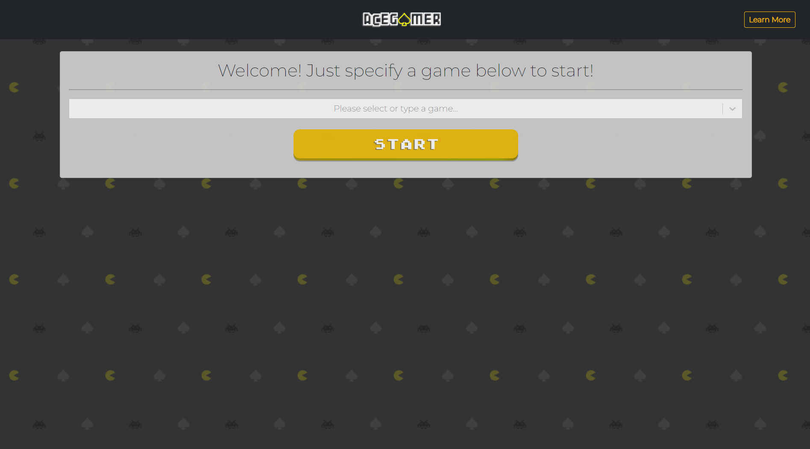
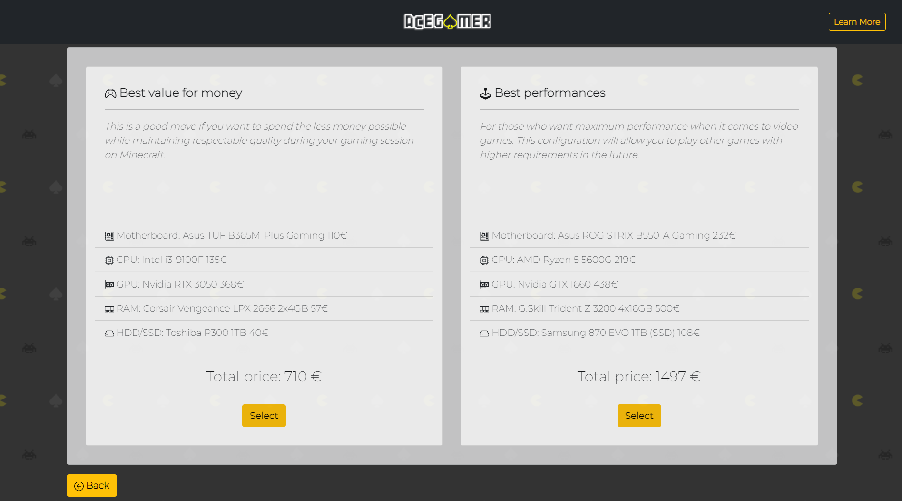
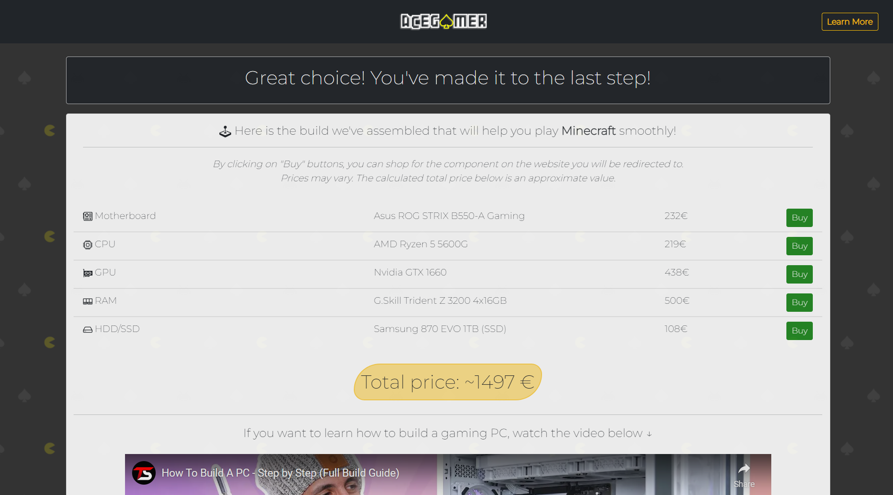

# AceGamerApp - Overview
AceGamerApp is a web application for anyone who wants to play a PC game that his/her current setup cannot run. With this application, we aimed to achieve an easy-to-use environment where they can easily find the components to acquire in order to upgrade their current setup, or to create the best fitting one from scratch. 

We've documented our project by following the steps called milestones as listed below:
1. Project Description and Needfinding
2. Prototyping and Heuristics
3. Wireframes
4. Usability Testing

## Building instructions
In the main folder:
```
cd client
npm install
npm start
cd ..
cd server
npm install
nodemon server.js
```

## Final results
Some of the pages can be seen in the following pictures:

<p align="center">
  <br/>
  <em>Home page where the users are expected to specify the game to start.</em>
</p>

<br/>

<p align="center">
  <br/>
  <em>The complete build selection page that is reached through the "New PC" path.</em>
</p>

<br/>

<p align="center">
  <br/>
  <em>The summary page as seen when the user completes the "New PC" path.</em>
</p>
